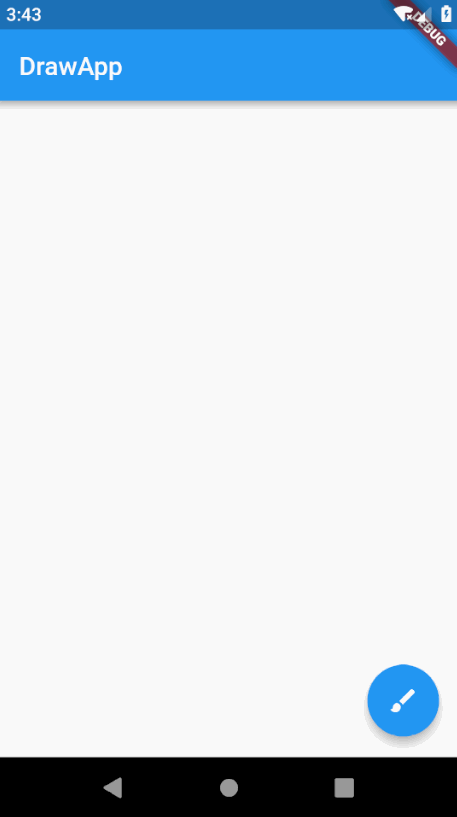

# DrawApp

Sample Flutter Drawing App which allows the user to draw onto the canvas along with color picker and brush thickness slider.

All code free to use and located within [/lib](https://github.com/SnakeyHips/drawapp/tree/master/lib).

Special thanks to stackoverflow user Andrey Turkovsky for helping out with color per drawn line issue. 

Merged with [domesticmouse/drawapp](https://github.com/domesticmouse/drawapp) which added cool stuff like BLoC pattern and tests. [Go here](https://github.com/SnakeyHips/drawapp/commit/7a3075bb3e33e5e7a4cef24dfed19d2cb26ee2fa) if you want a version without these which might be easily to understand for those without BLoC knowledge.
